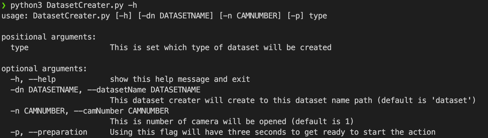

# Dataset Creater
  
現在機器學習、深度學習火紅的年代，有許多非常厲害的教授和研究人員，研發出了各種神經網路架構，以達到各種效果，但這些神經網路架構的源頭，或多或少都需要 Dataset 來訓練。  

而本專案就是為了希望可以讓收集 Dataset 別這麼痛苦，而衍生出來的小功能，自身在使用上已經自覺輕鬆一些，希望本專案可以幫助到大家，並且有機會用 PR 一起讓這 Video Dataset Creater 更為完善。

下方圖片為打 `python3 DatasetCreater.py -h` 得出的資訊，使用的套件為 Python 官方的 **argparse**。


## 需求
> // 之後來寫
> 
## 開始程式之參數解說
```
$ python3 DatasetCreater.py -h
usage: DatasetCreater.py [-h] [-dn DATASETNAME] [-n CAMNUMBER] [-p] type

positional arguments:
  type                  This is set which type of dataset will be created

optional arguments:
  -h, --help            show this help message and exit
  -dn DATASETNAME, --datasetName DATASETNAME
                        This dataset creater will create to this dataset name path (default is 'dataset')
  -n CAMNUMBER, --camNumber CAMNUMBER
                        This is number of camera will be opened (default is 1)
  -p, --preparation     Using this flag will have three seconds to get ready to start the action
```
如果只用一個相機，且資料集名稱使用預設 (dataset) 的話，可只需輸入想拍攝的類型名稱即可，如想拍攝 jump 類型只需打：
``` bash
$ python3 DatasetCreater.py jump
```
也可透過 `-dn` 或 `--datasetName` 決定要放在哪個資料夾裡，預設是黨名為 **dataset**。  
可輸入 `-n` 或 `--camNumber` 指定要開幾個相機，預設是只開一個。  
如果想要在拍攝影片前倒數讀 3 秒，可以加入 `-p` 或是 `--preparation` flag 即可。

## 拍攝 Dataset 操作方式
錄影：於鍵盤中按 `r` (切記要用英文輸入法)，畫面上會出現紅色 Recording 字樣。  
> // 範例影片之後附上  
> 
結束錄影：於鍵盤中按 `e` (切記要用英文輸入法)，畫面上紅色 Recording 字樣將會消失。  
> // 範例影片之後附上  
> 
影像逆時針旋轉 $90^o$：按 `n` (切記要用英文輸入法)，所有的畫面都會卡住，這時去開啟程式的終端機(Terminal)，會出現：
```
Input Rotate Camera>>
```
這時可以指定要旋轉的影像號碼，多個號碼給予方式為空白間隔開，例如要旋轉 0,1,4 的影像就輸入：
```
Input Rotate Camera>>0 1 4
```
而那些要指定的號碼都會顯示在視窗標題上。
> // 範例照片之後附上

## 下一步
- 將原始影像透過模糊、明亮度等等方式而外生成更豐富的 Dataset
- 將 `README.md` 英文化